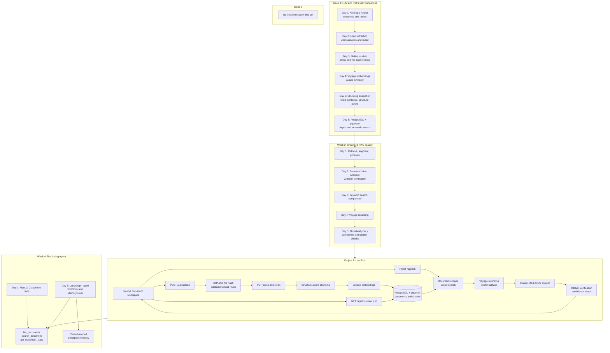

# FDE

Financial development engineering exercises and the LoanDoc document-intelligence project.

## Current Working Map

## Status

- Week 1: implemented Days 1-6.
- Week 2: implemented Days 1-5.
- Week 3: no tracked implementation files.
- Week 4: Day 1 manual tool agent and Day 3 LangGraph checkpointed agent implemented.
- Project 1: [LoanDoc](project1-loandoc/README.md) ingestion, grounded Q&A, citations, deployment configuration, and upload deduplication.