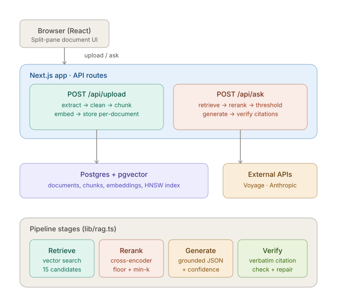

# LoanDoc — Document intelligence for structured finance

Upload a term sheet, servicing report, or prospectus and ask it questions. Every
answer is grounded in the source document, cites the exact passage it came from,
and carries a confidence signal — built for finance professionals who don't trust
an answer they can't trace.

> **Live demo:** _[add your Cloud Run URL]_ · **Demo video:** _[add link]_



---

## Why this exists

Generic document-QA tools answer confidently and hide their sources — a
non-starter in regulated finance, where an unverifiable claim is worse than no
answer. LoanDoc is built the other way around: retrieval quality is measured, every
citation is checked verbatim against the source text before display, and the system
refuses when the document doesn't contain the answer rather than inventing one.

## What it does

- **Upload any PDF** — parses messy real-world documents (two-column layouts,
  running headers, tables, hyphenated line-wraps), cleans them, and indexes them.
- **Ask in natural language** — retrieves the relevant passages, reranks them for
  true relevance, and generates a grounded answer.
- **Trace every claim** — each citation links to its source passage, which
  highlights in the document pane on click.
- **Know when to doubt** — a confidence score and a "verify against source" flag
  surface when an answer is drawn from weak or scattered context.
- **Refuse gracefully** — when the document doesn't cover the question, it says so
  instead of hallucinating.

## How it works

A question flows through five stages (`lib/rag.ts`):

1. **Retrieve** — vector search over pgvector returns 15 candidate passages.
2. **Rerank** — a cross-encoder re-scores candidates by true relevance to the
   question, producing sharp separation between answer and noise.
3. **Threshold** — passages above a confidence floor are selected, but never fewer
   than a minimum k, so multi-passage answers aren't starved.
4. **Generate** — the model answers in structured JSON using only the selected
   passages, emitting a verbatim quote for every claim.
5. **Verify** — each quote is checked against its cited passage; failures trigger a
   bounded repair loop. Verified answers carry a confidence score to the UI.

Ingestion runs a parallel path: extract → clean → chunk (structure-aware) → embed →
store, with each document isolated by `document_id` so retrieval never crosses
documents.

## Tech stack

| Layer | Choice |
|---|---|
| App framework | Next.js (App Router, API routes) |
| Language | TypeScript |
| Vector store | Postgres + pgvector (HNSW index) |
| Embeddings | Voyage `voyage-3.5-lite` |
| Reranking | Voyage `rerank-2.5-lite` |
| Generation | Anthropic Claude |
| PDF parsing | pdf-parse + custom cleaning layer |
| Deployment | Cloud Run + Cloud SQL, secrets in Secret Manager |

## Quick start

**Prerequisites:** Node 20+, Docker, a Voyage API key, an Anthropic API key.

```bash
# 1. Start Postgres + pgvector
docker run -d --name loandoc-pg \
  -e POSTGRES_PASSWORD=localdev -e POSTGRES_DB=loandoc \
  -p 5432:5432 pgvector/pgvector:pg16

# 2. Configure
cp .env.example .env.local
#   set ANTHROPIC_API_KEY, VOYAGE_API_KEY, DATABASE_URL

# 3. Apply schema
psql "$DATABASE_URL" -f schema.sql

# 4. Run
npm install
npm run dev        # http://localhost:3000
```

Then open the app, upload a PDF, and ask it a question.

## Railway deployment

This repository contains multiple projects. The root-level `railway.toml`
explicitly installs, builds, and starts `project1-loandoc`, so Railway can deploy
the repository without relying on auto-detection. Keep the Railway service Root
Directory empty; setting it to `project1-loandoc` would make the configured
`cd project1-loandoc` commands point to the wrong path.

Configure these environment variables in Railway:

```text
ANTHROPIC_API_KEY=...
VOYAGE_API_KEY=...
DATABASE_URL=postgresql://...
```

Railway supplies `PORT` automatically; `next start` reads it without a custom
start command. Use the default build/start commands from `package.json`:

```text
Build: npm run build
Start: npm run start
```

The root `nixpacks.toml` pins Railway's build/runtime image to Node 20. Do not
remove it: Next.js 16 requires Node 20.9+ and `pdf-parse` requires Node 20.16+
or Node 22.3+.

Apply `schema.sql` to the target Postgres database before the first upload. The
database must support the `vector` extension because LoanDoc stores
`vector(1024)` embeddings and creates an HNSW pgvector index.

## API

### `POST /api/upload`
Multipart form with a `file` field (PDF). Extracts, cleans, chunks, embeds, and
stores the document.

```bash
curl -X POST http://localhost:3000/api/upload -F "file=@term-sheet.pdf"
# → { "document_id": 1, "chunks": 17 }
```

### `POST /api/ask`
```bash
curl -X POST http://localhost:3000/api/ask \
  -H 'Content-Type: application/json' \
  -d '{"question":"What coupon do the Class A notes pay?","documentId":1}'
```
```json
{
  "answer": "The Class A notes pay a fixed coupon of 5.95%.",
  "citations": [{ "chunk_id": 18, "quote": "...", "supports": "..." }],
  "verified": true,
  "confidence": 0.68,
  "lowConfidence": false,
  "sufficient_context": true
}
```

### `GET /api/document/[id]`
Returns a document's chunks for rendering and citation highlighting.

## Design decisions

A few choices worth calling out, with their trade-offs:

- **Rerank over hybrid search.** Naive keyword search (Postgres full-text) added
  little on this corpus and injected noise — its AND-semantics returned nothing for
  natural-language questions, and OR-semantics matched common terms as strongly as
  rare ones. A cross-encoder reranker gave sharp, thresholdable relevance scores
  instead. Hybrid search becomes worthwhile at larger corpus sizes with a real BM25
  engine; it wasn't worth the noise here.

- **Confidence floor with a minimum-k fallback.** A flat relevance threshold
  cleanly handles single-fact questions but starves multi-passage answers — a key
  passage can sit just below the floor. Selecting above-floor-but-never-fewer-than-k
  passages handles both without a per-query rule.

- **Normalized citation verification.** Strict verbatim matching is incompatible
  with lossy PDF cleaning: dehyphenation and whitespace collapse introduce
  byte-level drift that breaks exact matching even when the answer is correct.
  Verification normalizes whitespace and case on both sides — trading a little
  fabrication-detection strictness for robustness to real documents.

- **The top reranker score as a whole-retrieval confidence gauge.** Simple factual
  questions score high (~0.85); multi-hop questions where the answer is scattered
  score notably lower (~0.56). That single number drives the UI's "verify against
  source" flag — a signal a bi-encoder's cosine scores can't provide.

## Project structure

```
app/
  page.tsx                  UI shell — split-pane layout, state
  components/               DocumentPane, AnswerPane
  api/
    upload/route.ts         ingestion pipeline
    ask/route.ts            question-answering pipeline
    document/[id]/route.ts  chunk fetch for rendering
lib/
  rag.ts                    retrieve → rerank → threshold → generate → verify
  pdf.ts                    extraction + cleaning layer
  chunk.ts                  structure-aware chunking
  embed.ts                  Voyage embeddings
  db.ts                     pg connection pool
schema.sql
```